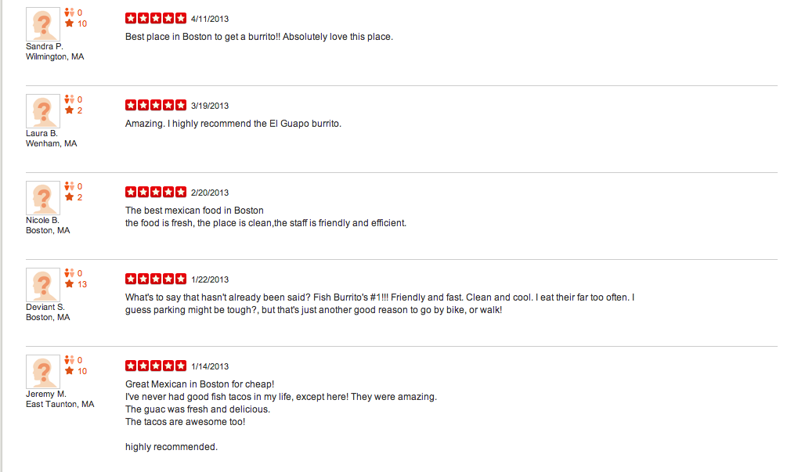
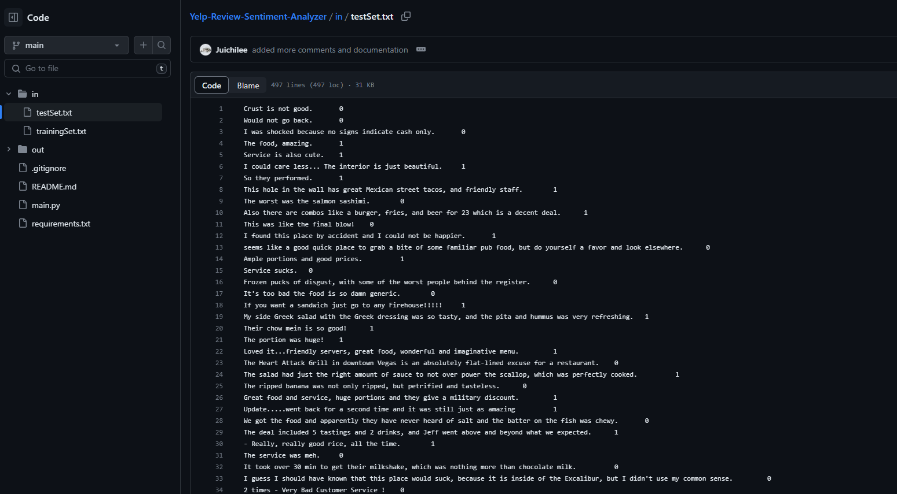
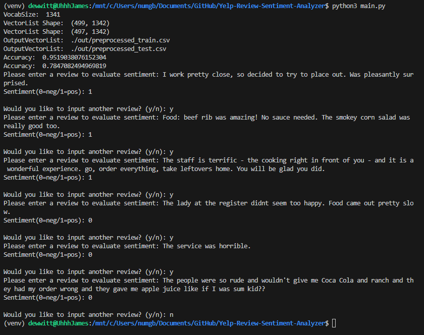
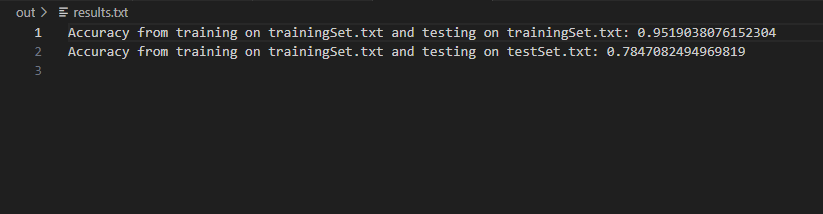

# ML-Text-Sentiment-Analyzer

This project implements a Naive Bayes classifier that preprocesses and trains on mock Yelp review text and predicts if a given review evokes a positive(1) or negative(0) sentiment 

## Demo
### Example Data

### Training, Testing, and Inference

### Output

## Dependencies
- python 3.10
- numpy 1.24.3
- WSL (Ubuntu 22.04.1 LTS) or similar

## Steps to Run
<ol>
  <li> python3 -m venv venv </li>
  <li> source venv/bin/activate </li>
  <li> pip install -r requirements.txt </li>
  <li> python3 main.py </li>
</ol>

<b>Author: Juichi Lee</b>

